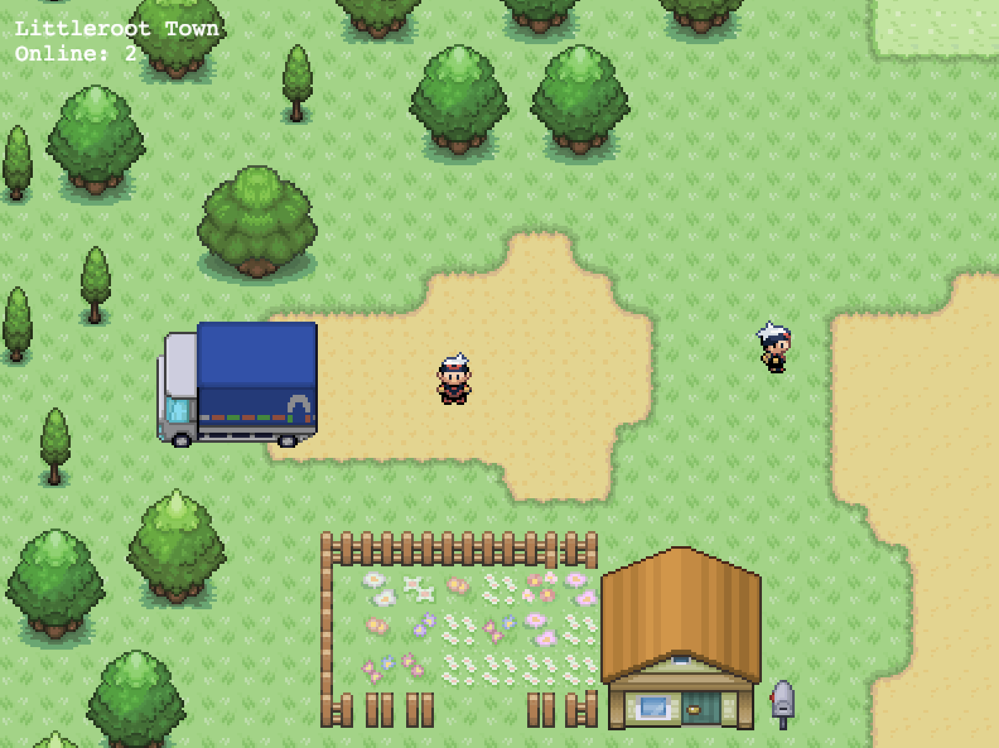

# littleroot

Littlroot is a MMORPG concept demo inspired by Pokemon Emerald.

### Live Demo
[Heroku](https://littleroot.herokuapp.com/)

### Controls
* __WASD__ *or* __↑←↓→__ to move
* __C__ to toggle collision layer (debugging)
* __M__ to toggle music

### Notes
* Fixed a bug that did not allow transitions between scenes
* Polished Oldale Town tilemap

### Known Bugs
* Stop animation frame out of sync
* Flicker between scenes

### To Do
* Clean up / refactor server-side code
* Remove redundant Packet class
* Compress packets & optimization
* Support for in-game events
* Additional tilemaps, scenes and transitions
* Smoother animations between scenes
